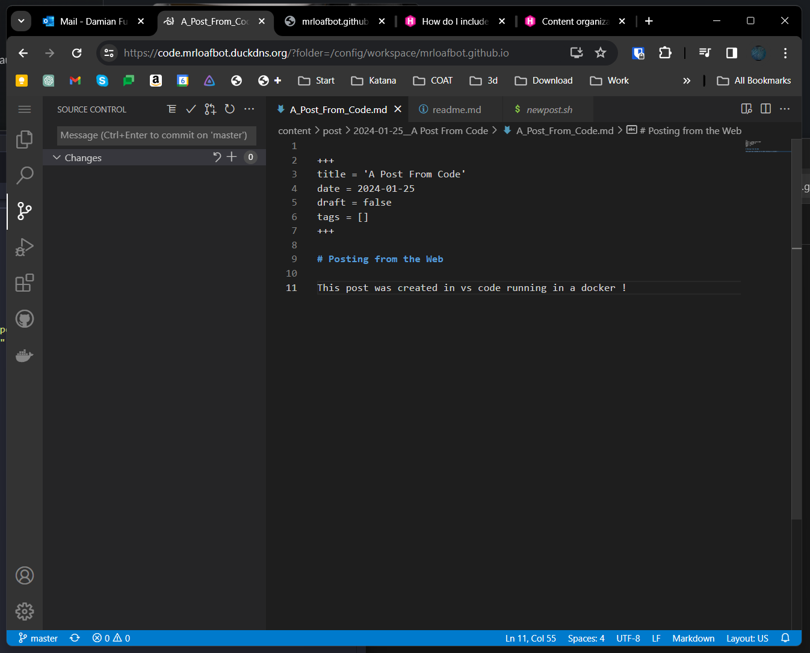

+++
title = 'A Post From Code'
date = 2024-01-25
draft = false
tags = []
authors = mrloafbot
image = "post/2024-01-25__a_post_from_code/vscode_server.png"
+++

# Posting from the Web

This post was created in vs code running in a docker !